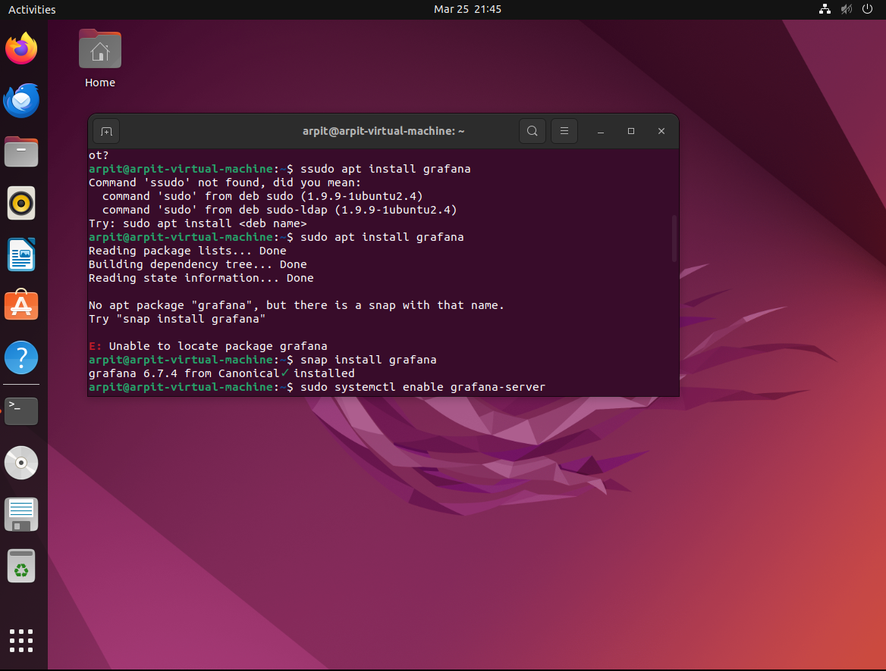

### Both Assignment-1 and Assignment-2 are present in this repository as previewed
```
---o---o---o---> /Assignment-1             branch : main
            \
             o---o---> /Assignment-2       branch : Assignment-2
``` 

# Assignment-1
### Monitoring a Kubernetes-Hosted Application Using SSO with Gmail, Syslog, Azure Log Analytics, and Grafana

## Team Members:

- Arpit Patel (041080697)
- Meet Dewani (041050046)
- Kalpitkumar Parekh (041093041)
- Devansh Sheth (041091741)

## Project Structure

```
├──Assignment-1
│    ├── flask-login
│    │   ├── .env (Environment variables)
│    │   ├── auth.py (Flask application code - OAuth handling)
│    │   ├── requirements.txt (Python dependencies)
|    |   └── templates (HTML templates to render on browser)
│    │       ├── login.html
│    │       └── hello.html
│    ├── Images
│    │   └── (contains 26 '.png' images)
│    ├── kubernetes
│    │   ├── deployment.yaml (Kubernetes deployment configuration)
│    │   └── service.yaml (Kubernetes service configuration)
│    ├── Dockerfile
│    └── README.md
├── .gitignore
└── LICENSE

4 directories, 9 files in Assignment-1 (excluding Images)
```

## Setup instructions:

In this assignment-1, our focus was on establishing and overseeing an application hosted on Kubernetes, integrating Single Sign-On (SSO) with Gmail, Syslog, Azure Log Analytics, and Grafana. The assignment encompassed several pivotal steps and configurations:

- Application Deployment: Deploy a sample Flask application on Kubernetes.
- Single Sign-On (SSO): Integrate Gmail-based authentication using OAuth 2.0.
- Log Collection: Implement a syslog server to gather application events.
- Centralized Logging: Configure the syslog server to forward logs to Azure Log Analytics.
- Visualization: Create insightful dashboards in Grafana using data from Azure Log Analytics.

---

1. Kubernetes Application Setup: This stage involved deploying an application within a Kubernetes cluster using a `service.yaml` and `deployment.yaml` file to execute a Docker image. This process ensures the proper containerization and hosting of the application within the Kubernetes environment.
2. Google SSO Implementation: We incorporated Google SSO to establish an authentication mechanism, allowing users to log in using their Gmail accounts, thereby bolstering security and user management.
3. Syslog Server Setup: A Syslog server was configured, and the application was configured to transmit logs to this server. This centralized logging and monitoring setup offers insights into application behavior and potential security incidents.
4. Integration with Azure Log Analytics: We executed steps to establish a Log Analytics Workspace, connect a virtual machine to Azure via Azure Arc, and create a data collection rule. This facilitates querying of Google SSO App logs within Azure Log Analytics, providing advanced monitoring and analysis capabilities.
5. Data Visualization using Grafana: Lastly, we installed and configured Grafana on a virtual machine, including tasks such as app registration, permission settings for Log Analytics API, client secret creation, and access control setup. This integration enables Grafana to connect to Azure Log Analytics Workspace and create dashboards for visualizing authentication attempts and other crucial data.

## Steps Performed

1. Application Deployment

- Execute the application within a Kubernetes cluster utilizing `service.yaml` and `deployment.yaml` files to launch the Docker image.


- Dockerfile with configurations in order to deploy application.


2. Google SSO Implementation

- Create Credentials and OAuth Consent Screen in Google Cloud APIs and Services.


- Access the live application by navigating to localhost:8000 in your web browser.


- Google SSO Authentication flow.


3. Syslog Server Setup

- Set up the configuration for the Syslog server.


- Set up the application to send logs to the Syslog server.


4. Integration with Azure Log Analytics

- Establish a Log Analytics Workspace on Azure Portal.


- Create Virtual Machine on Azure Portal.


- Create Data Collection Rules on Azure Log Analytics Workspace.


- Capable of querying logs from the Google SSO application within Log Analytics.


5. Data Visualization using Grafana

- Install Grafana and activate it on a virtual machine.


- Create/Utilize an App Registration in Azure Portal.


- Establish permissions to enable the Log Analytics API to read data.


- Create Client Secret for Grafana Dashboard.


- Grant access control to the registered application.


- Generate a dashboard to retrieve the count of authentication attempts.


- Queries utilized in the dashboard to track authentication attempts.


## Conclusion
The assignment showcases a detailed process for setting up and overseeing a secure application within Kubernetes, while also using Google SSO for logins, SysLog for managing logs, Azure Log Analytics, and Grafana for log analysis and visualization. This setup ensures the application is not only safe and accessible but also transparently monitored with essential tools, aligning with DevOps security and standards. Despite facing some issues in assigning the "Reader" role, we managed to connect Grafana to Azure and visualize metrics data from the AKS cluster hosting the Google SSO app.

---

- GitHub Repo:
[PatelArpittAC/CST8919-Assignments](https://github.com/PatelArpittAC/CST8919-Assignments)
