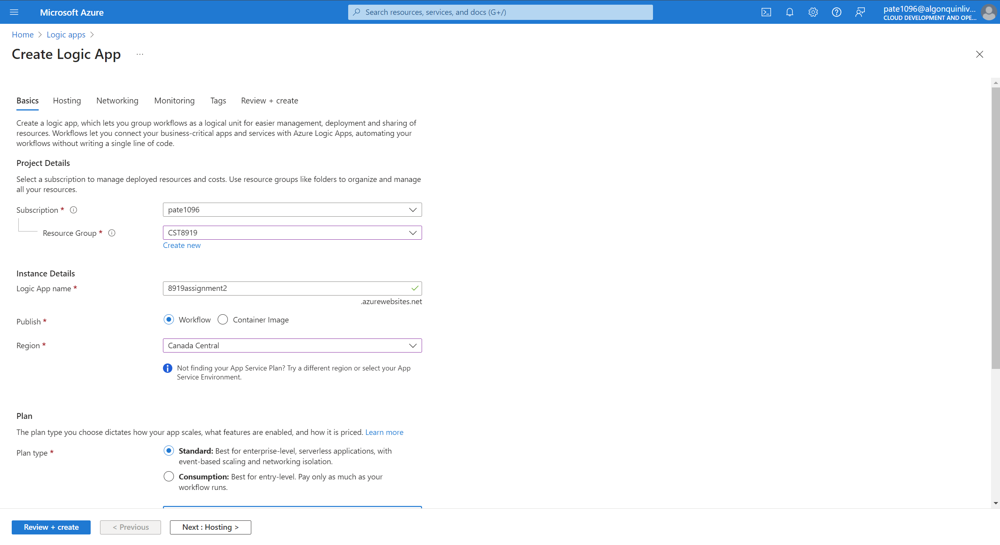
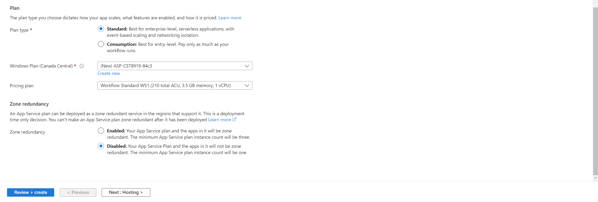
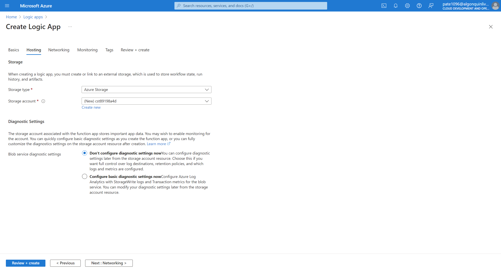
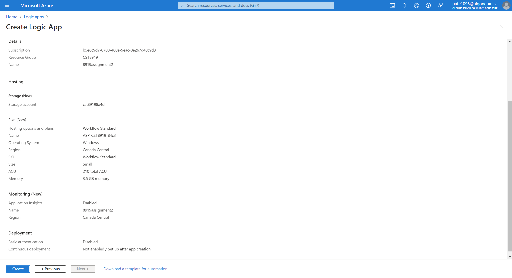
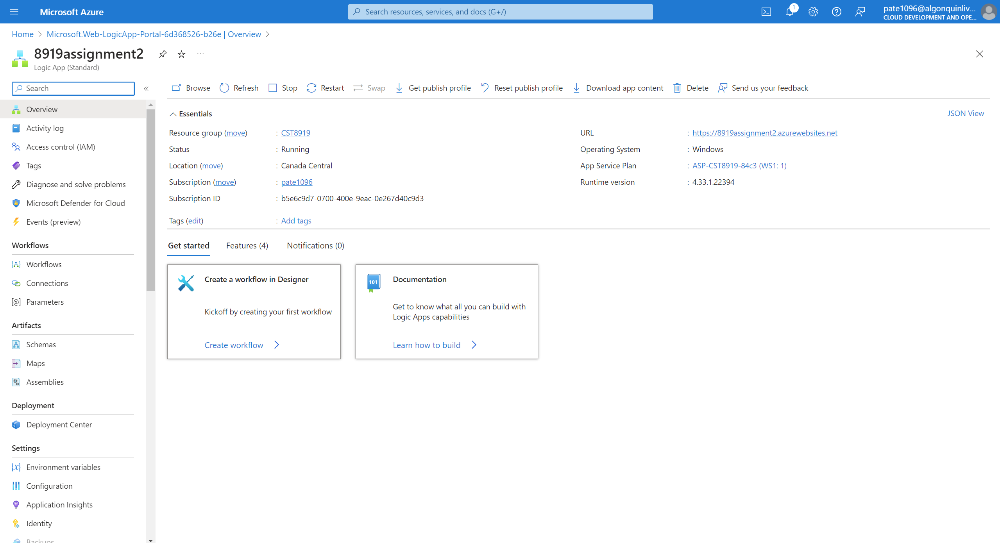
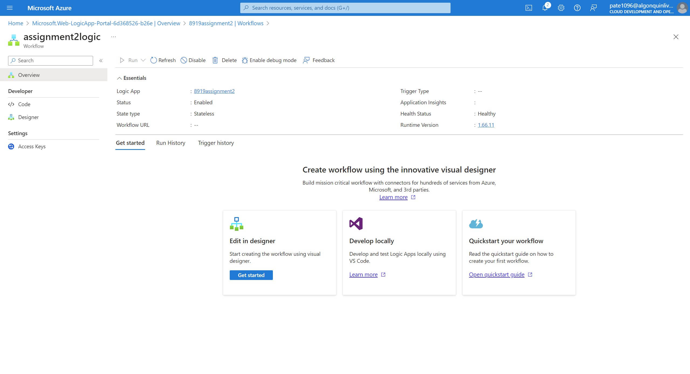
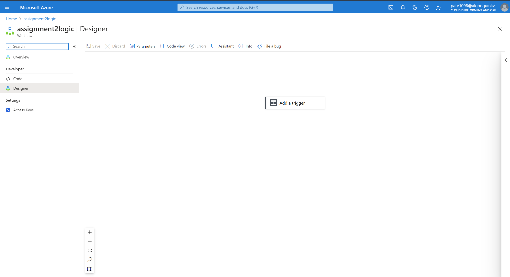
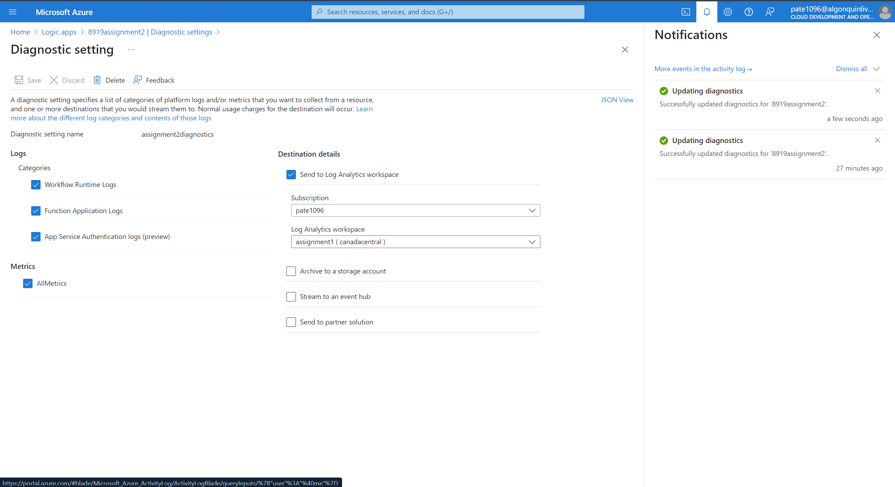
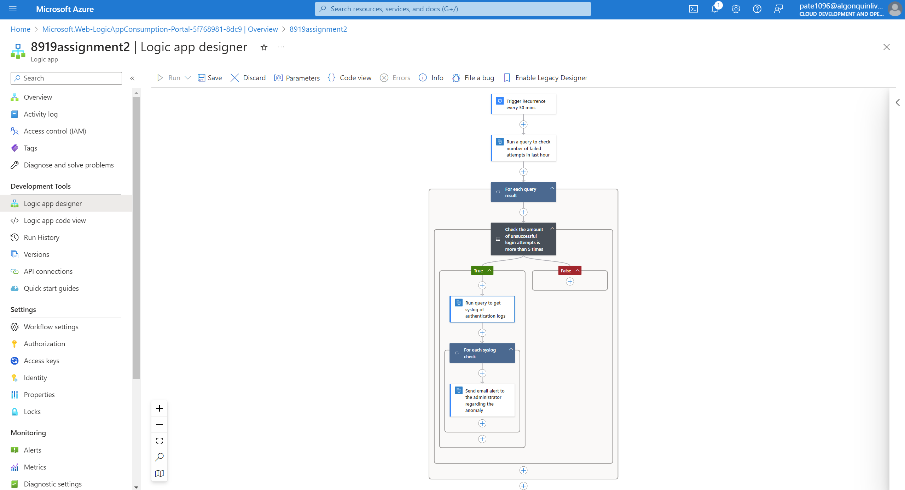

### Both Assignment-1 and Assignment-2 are present in this repository as previewed
```
---o---o---o---> /Assignment-1             branch : main
            \
             o---o---> /Assignment-2       branch : Assignment-2
``` 

# Assignment-2
### Automating Anomaly Detection and Alerting in Cloud Security

## Team Members:

- Arpit Patel (041080697)
- Meet Dewani (041050046)
- Kalpitkumar Parekh (041093041)
- Devansh Sheth (041091741)

## Project Structure

```
├──Assignment-1
├──Assignment-2
│    ├── Images
│    │   └── (contains 26 '.png' images)
│    └── README.md
├── .gitignore
└── LICENSE

1 directory, 1 file in Assignment-2 (excluding Images)
```

## Setup instructions:

### Part 1: Understanding Anomaly Detection

Detecting anomalies in security log analysis is vital for spotting unusual patterns or behaviors that stray from the usual, which could signal security threats like cyberattacks, system glitches, or unauthorized entry. These methods rely on data analytics, machine learning, and statistical approaches to keep tabs on, identify, and address anomalies within large, intricate datasets produced by IT systems and applications. This report briefly outlines some of the most potent anomaly detection methods relevant to security log analysis:

Anomaly detection methods can be broadly classified into the following categories:

1. Statistical Approaches: These methods operate under the assumption that regular behavior adheres to a clearly defined statistical distribution. Any significant deviation from this distribution indicates an anomaly. Techniques encompass:

- Supervised learning (e.g., utilizing labeled data to train models on recognized anomalies)
- Unsupervised learning (e.g., employing clustering algorithms like K-means or DBSCAN)
- Semi-supervised learning (combining both labeled and unlabeled data)

2. Rule-Based Approaches: These methods entail establishing explicit rules that delineate normal behavior. Any behavior contravening these rules is flagged as an anomaly. While this method is straightforward, it necessitates extensive domain knowledge to formulate accurate rules.

### Part 2: Preparing for Automation

- Establish Azure Logic App/Configuration.



- Creating Storage Account.




- Generate a workflow to subsequently set up triggers within the designer.



### Part 3: Implementing Anomaly Detection

In our system logs, if there are more than 5 instances of failed login attempts within a short timeframe, it should be marked as an anomaly. The application from the previous assignment has been modified to ensure a more consistent logging of "Failed Login" events. The system checks for these events every 30 minutes, a frequency that can be adjusted based on your preference. When triggered, an Azure monitor action runs a query to count the occurrences of failed logins within the last hour. The workflow then checks if this count exceeds 10. If it does, the system executes another query to retrieve details about the most recent failed login and sends this information to the administrator.

- Link to Azure Log Analytics: Utilize either the Azure Logic App to establish a connection with the Azure Log Analytics workspace created in Assignment 1.


- Logic App Workflow made in Logic App Designer:


### Part 4: Integrating Cloud Security Best Practices

### Maintaining Anomaly Detection Effectiveness

To ensure the anomaly detection system consistently identifies emerging threats, regular refinement of detection rules and algorithms is crucial. Establish a formal review cadence (e.g., monthly or quarterly) to enhance rules based on the latest threat intelligence and lessons learned from security incidents. Integrate real-time threat intelligence feeds to continuously update rules with the most recent threat indicators.  Furthermore, leverage machine learning algorithms that autonomously adapt, improving accuracy by analyzing detection outcomes (both false positives and negatives). Implement a stringent change management process to test all updates thoroughly in a staging environment prior to production deployment, safeguarding system integrity.

### Documentation, Communication, and Training

Maintain thorough documentation of all detection rule changes, providing accessible logs to relevant stakeholders, including compliance teams. Transparent communication of updates ensures alignment across the organization. Ongoing training for security personnel on AI/ML tools and evolving threat landscapes is essential. This continuous improvement approach bolsters cybersecurity posture and enhances the infrastructure's overall resilience against current and future attacks.


## Incident Response Plan

1. Preparation
- Establish Response Team: Designate a team with clear roles and responsibilities (investigators, communicators, technical specialists).
- Detection Tools: Continuously monitor systems using automated tools for threat detection and alerts.
- Communication Plan: Pre-define communication channels and escalation protocols.

2. Identification
- Alert Verification: Quickly assess alerts to distinguish between false positives and genuine threats.
- Severity Assessment: Determine the potential impact of a verified incident.

3. Containment
- Isolate Systems: Prevent the spread of the incident by isolating affected systems or networks.
- Evidence Preservation: Secure logs and other relevant data for forensic analysis.

4. Eradication
- Root Cause Analysis: Identify the vulnerability or attack vector that led to the incident.
- Remediation: Implement corrective actions (patching, credential changes, malware removal).

5. Recovery
- System Restoration: Restore systems and data to their pre-incident state from secure backups.
- Vulnerability Remediation: Address the underlying issues that contributed to the incident.

6. Post-Incident Analysis
- Lessons Learned: Conduct a thorough review to identify areas for improvement in detection, response, and prevention.
- Update Procedures: Refine the incident response plan and security protocols based on the findings.
- Training: Provide relevant team members with updated training based on incident analysis.

## Conclusion

This lab provided hands-on experience with Azure's security and automation tools. We used Azure Logic Apps to automate security monitoring and response, creating scripts to detect anomalies like failed logins and trigger appropriate actions. This reinforced the value of continuous monitoring and automated workflows for maintaining a secure cloud environment.

Key Takeaways:
- Proactive Security: The lab emphasized the importance of proactive monitoring and automated responses for timely threat detection and mitigation.
- Least Privilege: We applied the principle of least privilege to minimize risk by granting only essential access rights to accounts.
- Incident Response: The lab highlighted the need for a well-defined incident response plan to ensure swift and effective action in case of a security breach.

---

- GitHub Repo:
[PatelArpittAC/CST8919-Assignments](https://github.com/PatelArpittAC/CST8919-Assignments)
